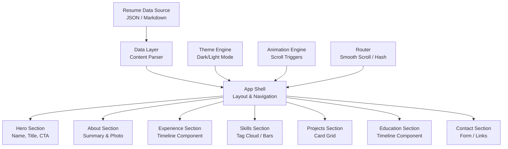
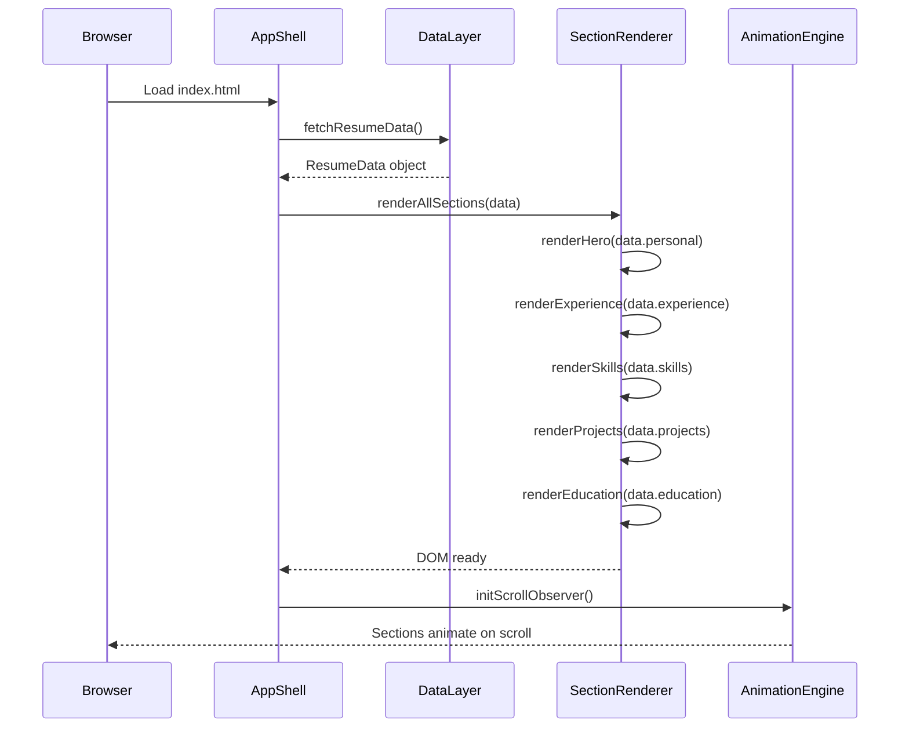
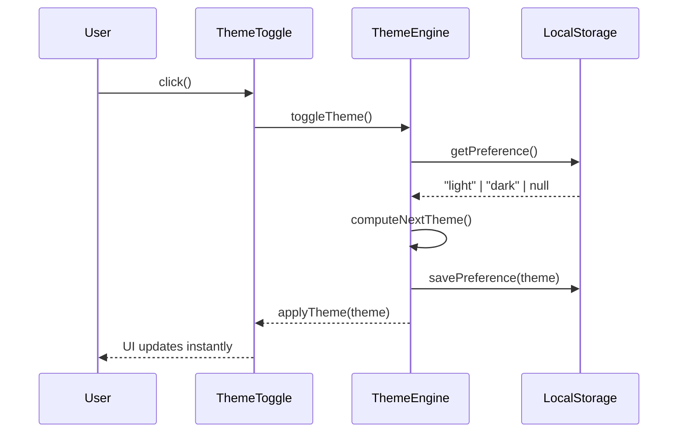
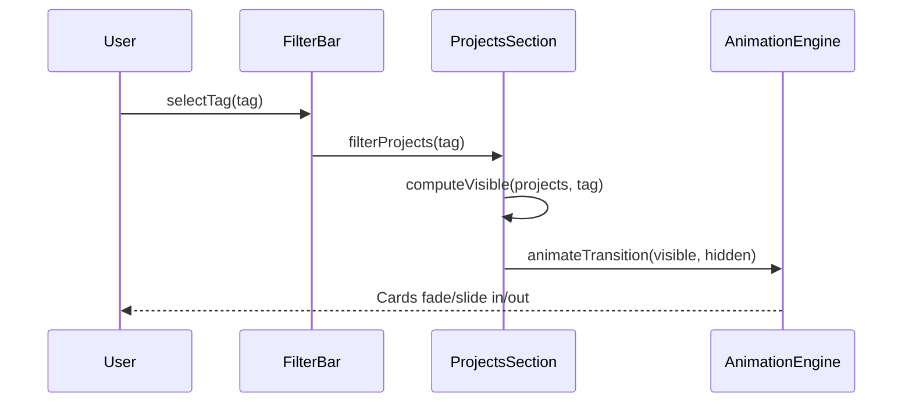

# Design Document: Resume Web Portfolio

## Overview

This feature converts a traditional resume into an interactive, modern web portfolio that presents professional experience, skills, projects, and education in an engaging single-page application. The portfolio is designed to be visually compelling, fast-loading, and fully responsive — serving as a personal brand hub that goes beyond a static document by incorporating animations, filtering, and dynamic content sections.

The architecture follows a component-based frontend approach with a static data layer (JSON/Markdown), enabling easy content updates without touching UI code. The portfolio is deployable as a static site to platforms like GitHub Pages, Vercel, or Netlify with zero backend dependencies.

## Architecture



## Sequence Diagrams

### Page Load & Render Flow



### Theme Toggle Flow



### Project Filter Flow



## Components and Interfaces

### Component 1: AppShell

**Purpose**: Root layout container managing navigation, routing, and global state (theme, active section).

**Interface**:
```pascal
INTERFACE AppShell
  PROCEDURE init()
  PROCEDURE renderAllSections(data: ResumeData)
  PROCEDURE setActiveSection(sectionId: String)
  PROCEDURE getTheme(): ThemeMode
END INTERFACE
```

**Responsibilities**:
- Bootstrap the application and load resume data
- Render the sticky navigation bar with section links
- Track scroll position to highlight the active nav item
- Inject the theme class on the root element

---

### Component 2: NavigationBar

**Purpose**: Sticky top navigation with smooth-scroll links and theme toggle button.

**Interface**:
```pascal
INTERFACE NavigationBar
  PROCEDURE render(sections: List<SectionMeta>)
  PROCEDURE setActiveLink(sectionId: String)
  PROCEDURE showMobileMenu()
  PROCEDURE hideMobileMenu()
END INTERFACE
```

**Responsibilities**:
- Render nav links for each section
- Highlight the currently visible section link
- Collapse into a hamburger menu on mobile viewports
- Host the dark/light mode toggle

---

### Component 3: HeroSection

**Purpose**: Full-viewport landing section with name, title, tagline, and call-to-action buttons.

**Interface**:
```pascal
INTERFACE HeroSection
  PROCEDURE render(personal: PersonalInfo)
  PROCEDURE animateEntrance()
END INTERFACE
```

**Responsibilities**:
- Display name, professional title, and a short tagline
- Render CTA buttons (Download Resume, Contact Me)
- Play entrance animation on first load
- Optionally render a profile photo or avatar

---

### Component 4: ExperienceSection

**Purpose**: Vertical timeline of work history entries.

**Interface**:
```pascal
INTERFACE ExperienceSection
  PROCEDURE render(jobs: List<Job>)
  PROCEDURE expandEntry(jobId: String)
  PROCEDURE collapseEntry(jobId: String)
END INTERFACE
```

**Responsibilities**:
- Render each job as a timeline card (company, role, dates, bullets)
- Support expand/collapse for bullet point details
- Animate cards into view on scroll

---

### Component 5: SkillsSection

**Purpose**: Visual representation of technical and soft skills.

**Interface**:
```pascal
INTERFACE SkillsSection
  PROCEDURE render(skills: List<SkillGroup>)
  PROCEDURE filterByCategory(category: String)
END INTERFACE
```

**Responsibilities**:
- Group skills by category (Languages, Frameworks, Tools, Soft Skills)
- Render as tag pills or animated progress bars
- Support category filtering

---

### Component 6: ProjectsSection

**Purpose**: Card grid of featured projects with tag-based filtering.

**Interface**:
```pascal
INTERFACE ProjectsSection
  PROCEDURE render(projects: List<Project>)
  PROCEDURE filterByTag(tag: String)
  PROCEDURE openProjectModal(projectId: String)
  PROCEDURE closeProjectModal()
END INTERFACE
```

**Responsibilities**:
- Render project cards (title, description, tech tags, links)
- Filter visible cards by technology tag
- Open a modal with full project details on card click

---

### Component 7: ContactSection

**Purpose**: Contact form and social/professional links.

**Interface**:
```pascal
INTERFACE ContactSection
  PROCEDURE render(contact: ContactInfo)
  PROCEDURE submitForm(formData: ContactFormData): FormResult
  PROCEDURE validateForm(formData: ContactFormData): ValidationResult
END INTERFACE
```

**Responsibilities**:
- Render email, LinkedIn, GitHub, and other profile links
- Provide an optional contact form (client-side validated)
- Show success/error feedback after form submission

---

### Component 8: ThemeEngine

**Purpose**: Manages dark/light mode preference with persistence.

**Interface**:
```pascal
INTERFACE ThemeEngine
  PROCEDURE init()
  PROCEDURE toggleTheme()
  PROCEDURE applyTheme(theme: ThemeMode)
  FUNCTION getCurrentTheme(): ThemeMode
END INTERFACE
```

**Responsibilities**:
- Read system preference via `prefers-color-scheme` media query
- Persist user override in `localStorage`
- Apply theme by toggling a CSS class on the root element

---

### Component 9: AnimationEngine

**Purpose**: Scroll-triggered entrance animations using IntersectionObserver.

**Interface**:
```pascal
INTERFACE AnimationEngine
  PROCEDURE init(targets: List<DOMElement>)
  PROCEDURE observeSection(element: DOMElement, animationClass: String)
  PROCEDURE unobserve(element: DOMElement)
END INTERFACE
```

**Responsibilities**:
- Register sections with IntersectionObserver
- Add animation CSS classes when elements enter the viewport
- Remove observer after first trigger to avoid re-animation

## Data Models

### Model 1: ResumeData

```pascal
STRUCTURE ResumeData
  personal:   PersonalInfo
  experience: List<Job>
  education:  List<EducationEntry>
  skills:     List<SkillGroup>
  projects:   List<Project>
  contact:    ContactInfo
END STRUCTURE
```

---

### Model 2: PersonalInfo

```pascal
STRUCTURE PersonalInfo
  name:       String        // Full name
  title:      String        // Professional title
  tagline:    String        // Short personal brand statement
  summary:    String        // About section paragraph
  avatarUrl:  String | Null // Optional profile photo URL
  resumeUrl:  String        // Link to downloadable PDF resume
END STRUCTURE
```

**Validation Rules**:
- `name` must be non-empty
- `title` must be non-empty
- `resumeUrl` must be a valid URL or relative path

---

### Model 3: Job

```pascal
STRUCTURE Job
  id:          String
  company:     String
  role:        String
  startDate:   String        // ISO 8601 date (YYYY-MM)
  endDate:     String | Null // Null means "Present"
  location:    String
  bullets:     List<String>  // Achievement/responsibility bullets
  tags:        List<String>  // Tech tags for filtering
END STRUCTURE
```

**Validation Rules**:
- `startDate` must be a valid YYYY-MM string
- `endDate` must be null or a valid YYYY-MM string after `startDate`
- `bullets` must have at least one entry

---

### Model 4: SkillGroup

```pascal
STRUCTURE SkillGroup
  category: String        // e.g. "Languages", "Frameworks"
  items:    List<Skill>
END STRUCTURE

STRUCTURE Skill
  name:  String
  level: Integer | Null   // Optional 1-5 proficiency level
END STRUCTURE
```

---

### Model 5: Project

```pascal
STRUCTURE Project
  id:          String
  title:       String
  description: String
  longDesc:    String | Null  // Full description for modal
  tags:        List<String>   // Technology tags
  repoUrl:     String | Null  // GitHub or source link
  liveUrl:     String | Null  // Live demo link
  imageUrl:    String | Null  // Preview screenshot
END STRUCTURE
```

---

### Model 6: ContactInfo

```pascal
STRUCTURE ContactInfo
  email:    String
  linkedin: String | Null
  github:   String | Null
  twitter:  String | Null
  website:  String | Null
END STRUCTURE
```

---

### Model 7: ContactFormData

```pascal
STRUCTURE ContactFormData
  senderName:    String
  senderEmail:   String
  subject:       String
  message:       String
END STRUCTURE
```

---

### Model 8: ValidationResult

```pascal
STRUCTURE ValidationResult
  isValid: Boolean
  errors:  Map<String, String>  // field name → error message
END STRUCTURE
```

## Algorithmic Pseudocode

### Main Initialization Algorithm

```pascal
PROCEDURE init()
  INPUT: none
  OUTPUT: none (side effects: DOM rendered, observers active)

  SEQUENCE
    theme ← ThemeEngine.init()
    data  ← DataLayer.fetchResumeData()

    IF data IS NULL THEN
      renderErrorState("Failed to load resume data")
      RETURN
    END IF

    AppShell.renderAllSections(data)
    NavigationBar.render(getSectionMeta())
    AnimationEngine.init(getAllSectionElements())

    window.addEventListener("scroll", onScroll)
  END SEQUENCE
END PROCEDURE
```

**Preconditions**:
- DOM is fully loaded (`DOMContentLoaded` fired)
- Resume data source (JSON file or inline object) is accessible

**Postconditions**:
- All sections are rendered in the DOM
- Scroll observer is active
- Theme is applied

---

### Scroll Active Section Algorithm

```pascal
PROCEDURE onScroll()
  INPUT: none (reads window.scrollY and section positions)
  OUTPUT: none (side effect: updates active nav link)

  SEQUENCE
    sections ← getAllSections()
    activeId ← null

    FOR each section IN sections DO
      bounds ← section.getBoundingClientRect()

      IF bounds.top <= VIEWPORT_THRESHOLD AND bounds.bottom > 0 THEN
        activeId ← section.id
      END IF
    END FOR

    IF activeId IS NOT NULL THEN
      NavigationBar.setActiveLink(activeId)
    END IF
  END SEQUENCE
END PROCEDURE
```

**Preconditions**:
- All section elements exist in the DOM with unique `id` attributes

**Postconditions**:
- Exactly one nav link is marked active at any scroll position

**Loop Invariants**:
- `activeId` always holds the id of the last section whose top edge has passed `VIEWPORT_THRESHOLD`

---

### Project Filter Algorithm

```pascal
PROCEDURE filterProjects(tag: String)
  INPUT: tag — selected technology tag, or "All"
  OUTPUT: none (side effect: updates visible project cards)

  SEQUENCE
    allCards ← getAllProjectCards()

    FOR each card IN allCards DO
      IF tag EQUALS "All" OR card.tags CONTAINS tag THEN
        card.show()
        AnimationEngine.animateIn(card)
      ELSE
        card.hide()
      END IF
    END FOR
  END SEQUENCE
END PROCEDURE
```

**Preconditions**:
- Project cards are rendered in the DOM
- Each card has a `data-tags` attribute with comma-separated tag values

**Postconditions**:
- Only cards matching the selected tag are visible
- If tag is "All", all cards are visible

**Loop Invariants**:
- Each card is either fully visible or fully hidden after each iteration

---

### Contact Form Validation Algorithm

```pascal
PROCEDURE validateForm(formData: ContactFormData): ValidationResult
  INPUT: formData — user-submitted form fields
  OUTPUT: ValidationResult with isValid flag and error map

  SEQUENCE
    errors ← empty Map

    IF formData.senderName IS EMPTY THEN
      errors["senderName"] ← "Name is required"
    END IF

    IF formData.senderEmail IS EMPTY THEN
      errors["senderEmail"] ← "Email is required"
    ELSE IF NOT isValidEmail(formData.senderEmail) THEN
      errors["senderEmail"] ← "Enter a valid email address"
    END IF

    IF formData.message IS EMPTY THEN
      errors["message"] ← "Message is required"
    ELSE IF LENGTH(formData.message) < 10 THEN
      errors["message"] ← "Message must be at least 10 characters"
    END IF

    RETURN ValidationResult {
      isValid: errors IS EMPTY,
      errors:  errors
    }
  END SEQUENCE
END PROCEDURE
```

**Preconditions**:
- `formData` is a non-null object with all four fields present (may be empty strings)

**Postconditions**:
- `isValid` is `true` if and only if `errors` map is empty
- Each field in `errors` maps to a human-readable message
- No mutations to `formData`

---

### Theme Initialization Algorithm

```pascal
PROCEDURE ThemeEngine.init(): ThemeMode
  INPUT: none
  OUTPUT: ThemeMode — the resolved theme ("light" | "dark")

  SEQUENCE
    stored ← LocalStorage.get("portfolio-theme")

    IF stored IS NOT NULL THEN
      RETURN applyTheme(stored)
    END IF

    systemPrefersDark ← window.matchMedia("(prefers-color-scheme: dark)").matches

    IF systemPrefersDark THEN
      RETURN applyTheme("dark")
    ELSE
      RETURN applyTheme("light")
    END IF
  END SEQUENCE
END PROCEDURE
```

**Preconditions**:
- `localStorage` is accessible (not blocked by browser policy)

**Postconditions**:
- A theme CSS class is applied to the root `<html>` element
- The resolved theme is returned for use by the toggle button

## Key Functions with Formal Specifications

### fetchResumeData()

```pascal
FUNCTION fetchResumeData(): ResumeData | Null
```

**Preconditions**:
- Resume data file exists at the configured path
- Data conforms to the `ResumeData` schema

**Postconditions**:
- Returns a fully populated `ResumeData` object on success
- Returns `Null` on parse error or network failure
- No side effects

---

### renderAllSections(data)

```pascal
PROCEDURE renderAllSections(data: ResumeData)
```

**Preconditions**:
- `data` is a non-null, valid `ResumeData` object
- DOM container elements for each section exist

**Postconditions**:
- All section components are rendered into the DOM
- Each section is initially hidden (opacity: 0) pending scroll animation
- No section is rendered more than once

---

### isValidEmail(email)

```pascal
FUNCTION isValidEmail(email: String): Boolean
```

**Preconditions**:
- `email` is a non-null string

**Postconditions**:
- Returns `true` if `email` matches the pattern `[chars]@[chars].[chars]`
- Returns `false` otherwise
- No mutations to input

---

### computeReadingTime(text)

```pascal
FUNCTION computeReadingTime(text: String): Integer
```

**Preconditions**:
- `text` is a non-null string

**Postconditions**:
- Returns estimated reading time in minutes (minimum 1)
- Based on average reading speed of 200 words per minute

**Loop Invariants**: N/A (single-pass word count)

## Example Usage

```pascal
// Bootstrap the portfolio on page load
SEQUENCE
  document.addEventListener("DOMContentLoaded", init)
END SEQUENCE

// Render a project card
SEQUENCE
  project ← Project {
    id:          "proj-1",
    title:       "E-Commerce Platform",
    description: "Full-stack shopping app with cart and checkout",
    tags:        ["React", "Node.js", "PostgreSQL"],
    repoUrl:     "https://github.com/user/ecommerce",
    liveUrl:     "https://shop.example.com",
    imageUrl:    "/images/ecommerce.png"
  }
  ProjectsSection.render([project])
END SEQUENCE

// Toggle theme on button click
SEQUENCE
  themeBtn.addEventListener("click", ThemeEngine.toggleTheme)
END SEQUENCE

// Filter projects by tag
SEQUENCE
  filterBar.onTagSelect ← PROCEDURE(tag)
    ProjectsSection.filterByTag(tag)
  END PROCEDURE
END SEQUENCE

// Validate and submit contact form
SEQUENCE
  formData ← ContactFormData {
    senderName:  "Alice Smith",
    senderEmail: "alice@example.com",
    subject:     "Collaboration Inquiry",
    message:     "Hi, I'd love to discuss a project with you."
  }

  result ← ContactSection.validateForm(formData)

  IF result.isValid THEN
    ContactSection.submitForm(formData)
  ELSE
    displayErrors(result.errors)
  END IF
END SEQUENCE
```

## Correctness Properties

*A property is a characteristic or behavior that should hold true across all valid executions of a system — essentially, a formal statement about what the system should do. Properties serve as the bridge between human-readable specifications and machine-verifiable correctness guarantees.*

### Property 1: Section Rendering Completeness

*For any* valid `ResumeData` object, `renderAllSections(data)` SHALL produce exactly one DOM node per section (Hero, About, Experience, Skills, Projects, Education, Contact) — no more, no less.

**Validates: Requirements 2.1, 2.2**

---

### Property 2: Project Filter Correctness

*For any* technology tag `t` and any set of project cards, after `filterProjects(t)` is called, every visible card SHALL satisfy `card.tags CONTAINS t OR t EQUALS "All"`, and every hidden card SHALL satisfy `card.tags DOES NOT CONTAIN t AND t IS NOT "All"`.

**Validates: Requirements 4.3, 4.4**

---

### Property 3: Contact Form Validation Soundness

*For any* `ContactFormData` object `f`, `validateForm(f).isValid` SHALL equal `true` if and only if `f.senderName` is non-empty, `f.senderEmail` is a valid email address, and `f.message` has at least 10 characters.

**Validates: Requirements 8.3, 8.4, 8.5, 8.6, 8.7, 8.8**

---

### Property 4: Theme Toggle Round-Trip

*For any* theme state `s`, calling `toggleTheme()` twice in succession SHALL return the `ThemeEngine` to state `s`.

**Validates: Requirements 6.5**

---

### Property 5: Scroll Active Section Uniqueness

*For any* scroll position `p`, `onScroll()` SHALL mark exactly one navigation link as active.

**Validates: Requirements 3.2**

---

### Property 6: Null End Date Renders as "Present"

*For any* `Job` entry `j` where `j.endDate IS NULL`, the rendered timeline card SHALL display "Present" as the end date.

**Validates: Requirements 2.8**

---

### Property 7: Email Validation Correctness

*For any* string `s`, `isValidEmail(s)` SHALL return `true` if and only if `s` matches the pattern `[chars]@[chars].[chars]`.

**Validates: Requirements 8.5**

---

### Property 8: Reading Time Minimum

*For any* string `text` (including the empty string), `computeReadingTime(text)` SHALL return an integer value of at least 1.

**Validates: Requirements 2.4**

---

### Property 9: Theme Persistence

*For any* `ThemeMode` value `t`, after `applyTheme(t)` is called, `localStorage.get("portfolio-theme")` SHALL return `t`.

**Validates: Requirements 6.4**

---

### Property 10: External Link Security

*For any* external URL rendered by the AppShell, the corresponding anchor element SHALL have both `rel="noopener"` and `rel="noreferrer"` attributes set.

**Validates: Requirements 10.4**

---

### Property 11: Input Sanitization (XSS Prevention)

*For any* user-supplied string containing HTML or script tags, the rendered DOM output SHALL not contain executable script content derived from that input.

**Validates: Requirements 10.3**

## Error Handling

### Error Scenario 1: Resume Data Load Failure

**Condition**: The JSON data file is missing, malformed, or fails to parse.
**Response**: Render a fallback error state with a friendly message ("Portfolio content is temporarily unavailable") and a retry button.
**Recovery**: On retry click, re-invoke `fetchResumeData()`. If successful, render normally.

---

### Error Scenario 2: Contact Form Submission Failure

**Condition**: The form submission endpoint (if used) returns a non-2xx response or times out.
**Response**: Display an inline error banner ("Message could not be sent. Please try again or email directly.") with the user's email address as a fallback.
**Recovery**: Keep form data populated so the user can retry without re-entering content.

---

### Error Scenario 3: Missing Optional Media

**Condition**: A project image URL or avatar URL returns a 404.
**Response**: Replace with a styled placeholder (initials avatar or generic project icon).
**Recovery**: No retry needed — placeholder persists gracefully.

---

### Error Scenario 4: LocalStorage Unavailable

**Condition**: Browser blocks `localStorage` access (private mode, security policy).
**Response**: Fall back to system `prefers-color-scheme` for theme; theme preference is not persisted.
**Recovery**: Theme still works per-session; no error shown to user.

## Testing Strategy

### Unit Testing Approach

Test each pure function and component in isolation:
- `validateForm()` — test all field combinations (empty, invalid email, short message, valid)
- `isValidEmail()` — test valid formats, missing `@`, missing domain, empty string
- `filterProjects()` — test "All" tag, exact tag match, no-match tag
- `ThemeEngine.init()` — mock `localStorage` and `matchMedia` to test all three branches
- `computeReadingTime()` — test empty string, single word, typical paragraph

### Property-Based Testing Approach

**Property Test Library**: fast-check

Key properties to test:
- `validateForm(f).isValid` is always `false` when any required field is empty
- `filterProjects(tag)` never shows a card that does not contain `tag` (when tag ≠ "All")
- `toggleTheme()` applied twice always returns to the original theme
- `renderAllSections(data)` always produces the same number of section nodes as `data` has non-null sections

### Integration Testing Approach

- Full page load test: verify all sections render with mock `ResumeData`
- Scroll behavior test: simulate scroll events and assert nav link active states
- Theme persistence test: toggle theme, reload page, assert theme is preserved
- Mobile menu test: resize viewport to mobile width, assert hamburger menu appears and functions

## Performance Considerations

- All images use `loading="lazy"` to defer off-screen image loads
- Resume data is inlined or fetched once and cached in memory — no repeated network calls
- CSS animations use `transform` and `opacity` only (GPU-composited, no layout thrash)
- IntersectionObserver is used instead of scroll event listeners for animation triggers (more performant)
- The portfolio targets a Lighthouse Performance score ≥ 90 on mobile
- Fonts are loaded with `font-display: swap` to prevent invisible text during load

## Security Considerations

- Contact form input is sanitized before display to prevent XSS (no raw `innerHTML` with user data)
- External links (GitHub, LinkedIn, live demos) use `rel="noopener noreferrer"`
- If a backend form endpoint is used, it must implement CSRF protection and rate limiting
- Resume PDF download link uses a relative path or trusted CDN — no user-controlled URLs
- Content Security Policy (CSP) headers should be configured on the hosting platform

## Dependencies

| Dependency | Purpose | Notes |
|---|---|---|
| Mermaid.js (optional) | Diagram rendering | Only if diagrams are embedded in portfolio |
| A CSS framework (e.g. Tailwind CSS) | Utility-first styling | Optional — can use vanilla CSS |
| A bundler (e.g. Vite) | Module bundling & dev server | Recommended for modern JS workflow |
| fast-check | Property-based testing | Dev dependency |
| A testing framework (e.g. Vitest / Jest) | Unit & integration tests | Dev dependency |
| IntersectionObserver API | Scroll animations | Native browser API — no library needed |
| localStorage API | Theme persistence | Native browser API — no library needed |
