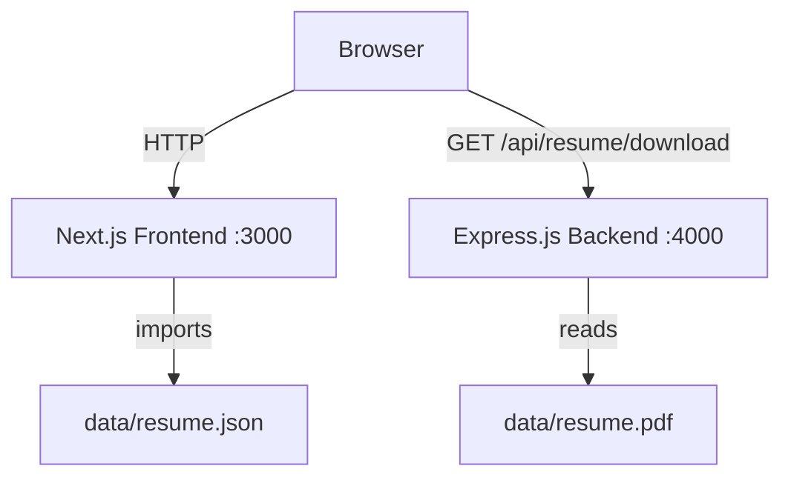

# Design Document

## Flutter Developer Portfolio — Suchandra Mondal

---

## Overview

This document describes the technical design for an interactive single-page portfolio website for Flutter developer Suchandra Mondal. The site is built with a **Next.js App Router** frontend and a minimal **Express.js** backend. All resume content is driven from a single `resume.json` file. The visual style follows the existing bento glassmorphism HTML template: dark background (`#050505` / `#080808`), Flutter blue palette (`#027DFD`, `#54C5F8`), and `backdrop-filter: blur` glass cards.

The project lives entirely inside `flutter_portfolio/` and must not affect any files outside that directory.

### Key Design Goals

- Single JSON source of truth for all content
- Glassmorphism bento-grid hero matching the existing HTML template
- Dark/light theme with FOUC prevention
- Scroll-triggered entrance animations via `IntersectionObserver`
- Resume PDF download via Express.js backend
- Contact form with client-side validation and XSS sanitization
- Fully responsive from 320px to 2560px
- No external UI libraries, no Tailwind

---

## Architecture

The system is split into two independently runnable services:

```
flutter_portfolio/
├── frontend/          # Next.js App Router (port 3000)
└── backend/           # Express.js API server (port 4000)
```



**Data flow:**
- The frontend imports `resume.json` at build time (static import in Next.js). No runtime API calls for content.
- The backend serves only one endpoint: `GET /api/resume/download`. The frontend calls this when the user clicks "Download Resume".
- Theme state lives in `localStorage` and a `data-theme` attribute on `<html>`.
- Animation state lives in the DOM via CSS class toggling (`reveal` → `reveal visible`).

---

## Components and Interfaces

### Frontend Component Tree

```
app/
├── layout.js          # Root layout — injects inline theme script, metadata
├── page.js            # Client component — owns theme state, composes all sections
└── globals.css        # All CSS: variables, glass, bento, sections, responsive

components/
├── Nav.js             # Sticky glassmorphism nav, hamburger, theme toggle
├── BentoHero.js       # Bento grid hero with 7 glass cards
├── About.js           # About section
├── Experience.js      # Vertical timeline
├── Skills.js          # Categorized skill pill groups
├── Projects.js        # Project card grid
├── Education.js       # Education cards
├── Contact.js         # Contact info + Contact_Form
└── useReveal.js       # IntersectionObserver hook
```

### Component Interfaces

**`page.js`** — root client component
```js
// State: theme ('dark' | 'light')
// Reads: resume.json (static import)
// Renders: Nav + BentoHero + About + Experience + Skills + Projects + Education + Contact + Footer
```

**`Nav.js`**
```js
// Props: { theme: string, toggleTheme: () => void }
// State: menuOpen (bool), activeSection (string)
// Behavior: scroll spy, hamburger toggle, smooth scroll on link click
```

**`BentoHero.js`**
```js
// Props: { data: ResumeData }
// Renders: 7 glass cards in a CSS Grid bento layout
// Cards: bio, status, project, skills, experience-summary, stats, contact-CTA
```

**`Experience.js`**
```js
// Props: { jobs: Job[] }
// Renders: vertical timeline, each entry has company, role, dates, location, bullets
```

**`Skills.js`**
```js
// Props: { skills: SkillCategory[] }
// Renders: categorized pill groups
```

**`Projects.js`**
```js
// Props: { projects: Project[] }
// Renders: card grid with name, description, tags, optional store/live badges
```

**`Education.js`**
```js
// Props: { education: EducationEntry[] }
// Renders: cards with degree, institution, year, location
```

**`Contact.js`**
```js
// Props: { personal: Personal }
// Renders: contact links (email, phone, LinkedIn) + Contact_Form
```

**`useReveal.js`**
```js
// Returns: ref — attach to any element to trigger entrance animation on scroll
// Behavior: IntersectionObserver with threshold 0.15, adds 'visible' class once
// Respects: prefers-reduced-motion (skips animation, sets visible immediately)
```

### Backend Interface

**`server.js`** — Express.js
```
GET /api/resume/download
  → 200: streams resume.pdf with Content-Type: application/pdf
         Content-Disposition: attachment; filename="Suchandra_Mondal_Resume.pdf"
  → 404: { "error": "Resume not found" }

CORS: allows origin http://localhost:3000 (configurable via env)
```

---

## Data Models

### `resume.json` Schema

```json
{
  "personal": {
    "name": "string",
    "title": "string",
    "summary": "string",
    "email": "string",
    "phone": "string",
    "location": "string",
    "linkedin": "string",
    "availability": "string"
  },
  "skills": [
    { "category": "string", "items": ["string"] }
  ],
  "experience": [
    {
      "id": "string",
      "company": "string",
      "role": "string",
      "startDate": "string",
      "endDate": "string | null",
      "location": "string",
      "bullets": ["string"],
      "tags": ["string"]
    }
  ],
  "education": [
    {
      "id": "string",
      "institution": "string",
      "degree": "string",
      "field": "string",
      "startDate": "string",
      "endDate": "string"
    }
  ],
  "projects": [
    {
      "id": "string",
      "title": "string",
      "description": "string",
      "tags": ["string"],
      "storeUrl": "string | null",
      "liveUrl": "string | null",
      "repoUrl": "string | null"
    }
  ],
  "stats": {
    "yearsExperience": "string",
    "yearsFlutter": "string",
    "enterpriseApps": "string",
    "platforms": "string"
  },
  "certifications": ["string"]
}
```

**Suchandra Mondal's data** (populated in `resume.json`):
- `personal.name`: "Suchandra Mondal"
- `personal.title`: "Flutter Developer | Mobile App Developer (iOS & Android)"
- `personal.location`: "Hyderabad, India"
- `personal.email`: "msuchandra27@gmail.com"
- `personal.phone`: "9830253747"
- `personal.linkedin`: "https://www.linkedin.com/in/suchandra-mondal-3a4652196"
- `stats`: `{ yearsExperience: "6+", yearsFlutter: "5+", enterpriseApps: "3+", platforms: "4" }`
- Experience: Capgemini (Sr. Consultant, 06/2022–Present), Ivan Infotech (Flutter Dev, 04/2020–06/2022), Pitangent Analytics (Android Dev, 04/2019–01/2020), Openweb Solutions (Junior Android Dev, 11/2018–03/2019)

### CSS Custom Properties (Theme Variables)

```css
/* Dark theme (default) */
:root {
  --bg:          #050505;
  --bg2:         #080808;
  --border:      rgba(255,255,255,0.09);
  --text:        #ffffff;
  --text2:       rgba(255,255,255,0.45);
  --accent:      #027DFD;
  --accent2:     #54C5F8;
  --glass-bg:    rgba(255,255,255,0.04);
  --glass-border:rgba(255,255,255,0.09);
  --nav-bg:      rgba(5,5,5,0.8);
}

/* Light theme */
[data-theme="light"] {
  --bg:          #f5f5f5;
  --bg2:         #ebebeb;
  --border:      rgba(2,125,253,0.15);
  --text:        #111111;
  --text2:       #555555;
  --accent:      #027DFD;
  --accent2:     #0056b3;
  --glass-bg:    rgba(255,255,255,0.65);
  --glass-border:rgba(2,125,253,0.2);
  --nav-bg:      rgba(245,245,245,0.85);
}
```

### Bento Grid Layout

The bento grid mirrors the existing HTML template's 3-column layout:

| Card | Span (desktop) | Span (≤640px) | Span (≤420px) |
|------|---------------|---------------|---------------|
| bio | col 2 | col 2 | col 1 |
| status | col 1 | col 1 | col 1 |
| project | col 1 | col 1 | col 1 |
| skills | col 2 | col 2 | col 1 |
| experience-summary | col 3 | col 2 | col 1 |
| stats | col 2 | col 2 | col 1 |
| contact-CTA | col 1 | col 1 | col 1 |

---

## Correctness Properties

*A property is a characteristic or behavior that should hold true across all valid executions of a system — essentially, a formal statement about what the system should do. Properties serve as the bridge between human-readable specifications and machine-verifiable correctness guarantees.*

Property-based testing is applicable here because the portfolio has several pure render functions and data-binding behaviors that should hold universally across all valid inputs (any resume JSON, any theme value, any form input). We use **fast-check** as the PBT library.

---

### Property 1: Missing top-level keys produce empty states, not errors

*For any* subset of the required top-level keys (`personal`, `skills`, `experience`, `education`, `projects`, `stats`, `certifications`) that are absent from the resume data object, rendering the corresponding section component should not throw a runtime error and should render an empty/fallback state.

**Validates: Requirements 1.4**

---

### Property 2: Bio card renders all personal data fields

*For any* valid `personal` data object containing `name`, `title`, `location`, and `summary`, the BentoHero bio card render output should include all four values.

**Validates: Requirements 2.5**

---

### Property 3: Project card renders first project's data

*For any* non-empty `projects` array, the BentoHero project card render output should include the first project's `title`, `description`, and all entries from its `tags` array.

**Validates: Requirements 2.7**

---

### Property 4: Skills card renders all skill items

*For any* `skills` array, the BentoHero skills card render output should include every skill item string from every category.

**Validates: Requirements 2.8**

---

### Property 5: Stats card renders all stat values

*For any* `stats` object, the stats card render output should include all four stat values (`yearsExperience`, `yearsFlutter`, `enterpriseApps`, `platforms`).

**Validates: Requirements 2.9**

---

### Property 6: Contact CTA card renders correct mailto link

*For any* email address string in `personal.email`, the contact-CTA card render output should include a `mailto:` link containing that exact email address.

**Validates: Requirements 2.10**

---

### Property 7: Experience timeline renders all entry fields

*For any* `experience` array, the Experience component render output should include each entry's `company`, `role`, and at least one bullet from `bullets` for every entry in the array.

**Validates: Requirements 3.3**

---

### Property 8: Skills section renders all categories and items

*For any* `skills` array with categories, the Skills component render output should include each category's `category` name and all of its `items`.

**Validates: Requirements 3.4**

---

### Property 9: Projects section renders all project data

*For any* `projects` array, the Projects component render output should include each project's `title`, `description`, and all entries from its `tags` array.

**Validates: Requirements 3.5**

---

### Property 10: Education section renders all entry fields

*For any* `education` array, the Education component render output should include each entry's `degree` and `institution`.

**Validates: Requirements 3.6**

---

### Property 11: Contact section renders all contact fields

*For any* `personal` object containing `email`, `phone`, and `linkedin`, the Contact component render output should include all three values.

**Validates: Requirements 3.7**

---

### Property 12: Theme application sets data-theme attribute

*For any* theme value in `{ 'dark', 'light' }`, calling `applyTheme(theme)` should set `document.documentElement.getAttribute('data-theme')` to that exact value.

**Validates: Requirements 5.1**

---

### Property 13: Theme persistence round-trip

*For any* theme value in `{ 'dark', 'light' }`, after `persistTheme(theme)` is called, `localStorage.getItem('portfolio-theme')` should return that exact value.

**Validates: Requirements 5.2**

---

### Property 14: Theme initialization reads localStorage first

*For any* theme value stored in `localStorage` under `'portfolio-theme'`, `getInitialTheme()` should return that stored value regardless of the system `prefers-color-scheme`.

**Validates: Requirements 5.3**

---

### Property 15: Intersection triggers visible class

*For any* DOM element observed by `useReveal`, when the `IntersectionObserver` callback fires with `isIntersecting: true`, the element should have the CSS class `'visible'` added to it.

**Validates: Requirements 6.2**

---

### Property 16: Animation is idempotent (no re-animation)

*For any* DOM element that already has the `'visible'` class, triggering the intersection callback again should leave the element's class list unchanged (the observer should have already unobserved the element).

**Validates: Requirements 6.4**

---

### Property 17: Reduced-motion skips animation

*For any* DOM element observed by `useReveal` when `prefers-reduced-motion: reduce` is active, the element should be immediately set to `opacity: 1` without waiting for intersection.

**Validates: Requirements 6.5**

---

### Property 18: Empty required fields produce validation errors

*For any* non-empty subset of the required Contact_Form fields (`name`, `email`, `message`) that are left empty, calling `validateForm` should return validation errors for each empty field and should not indicate a successful submission.

**Validates: Requirements 8.2**

---

### Property 19: Invalid email format produces validation error

*For any* string that does not match a valid email format (i.e., does not contain `@` with non-empty local and domain parts), `validateEmail(input)` should return `false` or an error message.

**Validates: Requirements 8.3**

---

### Property 20: Valid form submission shows success and resets fields

*For any* valid form data object with non-empty `name`, valid `email`, and non-empty `message`, calling `submitForm(data)` should return a success result and the form state should be reset to empty strings.

**Validates: Requirements 8.4**

---

### Property 21: Sanitize strips executable script content

*For any* string containing HTML special characters (`<`, `>`, `"`, `'`, `&`) or `<script>` tags, `sanitize(input)` should return a string that does not contain unescaped `<script` or `</script` substrings, preventing XSS injection.

**Validates: Requirements 8.5**

---

**Property Reflection — Redundancy Check:**

- Properties 2–6 all test BentoHero card data binding. They are not redundant because each tests a different card with different data shape.
- Properties 7–11 test different section components with different data shapes — not redundant.
- Properties 12–14 test different aspects of the Theme_Engine (apply, persist, initialize) — not redundant.
- Properties 15–17 test different aspects of the Animation_Engine (trigger, idempotence, reduced-motion) — not redundant.
- Properties 18–21 test different aspects of form validation (empty fields, invalid email, valid submission, sanitization) — not redundant.
- Properties 8 and 4 both test skills rendering but in different contexts (BentoHero card vs. full Skills section) — kept separate as they test different components.

No redundancies identified. All 21 properties provide unique validation value.

---

## Error Handling

### Frontend

| Scenario | Handling |
|----------|----------|
| Missing top-level key in `resume.json` | Component renders empty state (empty array / empty string defaults via optional chaining and nullish coalescing) |
| Resume PDF download fetch fails (network error) | Button shows inline error message; no page crash |
| Resume PDF download returns 404 | Button shows "Resume not available" message |
| Contact form XSS input | `sanitize()` escapes HTML entities before any DOM insertion |
| `IntersectionObserver` not supported | Elements rendered at full opacity immediately (graceful degradation) |
| `localStorage` not available (private browsing) | Theme falls back to `prefers-color-scheme`; no crash |

### Backend

| Scenario | Handling |
|----------|----------|
| `resume.pdf` not found on disk | `404 { "error": "Resume not found" }` |
| Unexpected server error | `500 { "error": "Internal server error" }` |
| CORS violation | Express CORS middleware rejects with appropriate headers |

### FOUC Prevention

`layout.js` injects an inline `<script>` in the `<head>` that reads `localStorage` and sets `data-theme` on `<html>` synchronously before the page renders:

```js
// Inline script in layout.js <head>
(function() {
  const stored = localStorage.getItem('portfolio-theme');
  const preferred = stored || (window.matchMedia('(prefers-color-scheme: dark)').matches ? 'dark' : 'light');
  document.documentElement.setAttribute('data-theme', preferred);
})();
```

---

## Testing Strategy

### Test Stack

- **Test runner**: Vitest
- **Property-based testing**: fast-check
- **DOM environment**: jsdom (via Vitest's `environment: 'jsdom'`)
- **React testing**: `@testing-library/react`

### Test File Structure

```
flutter_portfolio/frontend/
└── tests/
    ├── unit/
    │   ├── Nav.test.js
    │   ├── BentoHero.test.js
    │   ├── Experience.test.js
    │   ├── Skills.test.js
    │   ├── Projects.test.js
    │   ├── Education.test.js
    │   ├── Contact.test.js
    │   ├── themeEngine.test.js
    │   └── contactForm.test.js
    └── property/
        ├── dataBinding.property.test.js   # Properties 1–11
        ├── themeEngine.property.test.js   # Properties 12–14
        ├── animationEngine.property.test.js # Properties 15–17
        └── contactForm.property.test.js   # Properties 18–21
```

### Unit Tests (Example-Based)

Unit tests cover specific behaviors and integration points:

- Nav renders all section links; hamburger toggles menu; clicking a link closes menu
- Theme toggle button switches between dark and light
- Download Resume button triggers fetch to correct URL
- Contact form renders all 3 fields
- Backend: `GET /api/resume/download` returns 200 with correct headers; returns 404 when file missing
- `layout.js` contains inline theme script in `<head>`

### Property-Based Tests

Each property test uses fast-check with a minimum of **100 iterations**. Each test is tagged with a comment referencing its design property.

**Tag format:** `// Feature: flutter-developer-portfolio, Property N: <property_text>`

**Example — Property 21 (sanitize):**
```js
// Feature: flutter-developer-portfolio, Property 21: Sanitize strips executable script content
fc.assert(fc.property(
  fc.string().filter(s => s.includes('<') || s.includes('>')),
  (input) => {
    const result = sanitize(input);
    return !result.includes('<script') && !result.includes('</script');
  }
), { numRuns: 100 });
```

**Example — Property 13 (theme persistence round-trip):**
```js
// Feature: flutter-developer-portfolio, Property 13: Theme persistence round-trip
fc.assert(fc.property(
  fc.constantFrom('dark', 'light'),
  (theme) => {
    persistTheme(theme);
    return localStorage.getItem('portfolio-theme') === theme;
  }
), { numRuns: 100 });
```

### PBT Applicability Assessment

PBT is appropriate for this feature because:
- The data-binding render functions are pure (props in → HTML string out) and their correctness should hold for any valid input shape
- The Theme_Engine functions (`applyTheme`, `persistTheme`, `getInitialTheme`) are pure or near-pure with clear input/output contracts
- The Animation_Engine hook has idempotence and reduced-motion properties that hold universally
- The contact form validation functions are pure with a large input space (any string for email, any combination of empty/filled fields)
- The `sanitize` function is pure with an infinite input space

PBT is **not** used for:
- CSS layout and responsive breakpoints (visual, not functional)
- Nav scroll behavior (DOM interaction, example-based)
- Backend PDF serving (file I/O, example-based)
- FOUC prevention (script execution order, example-based)
